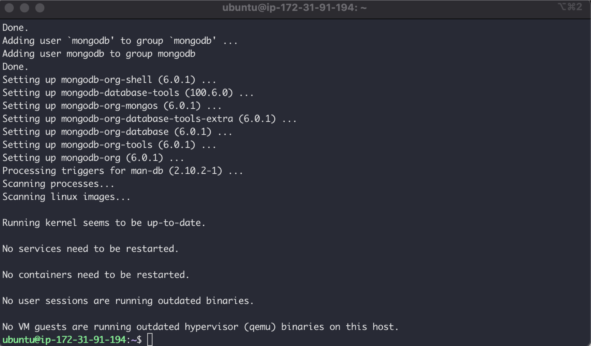
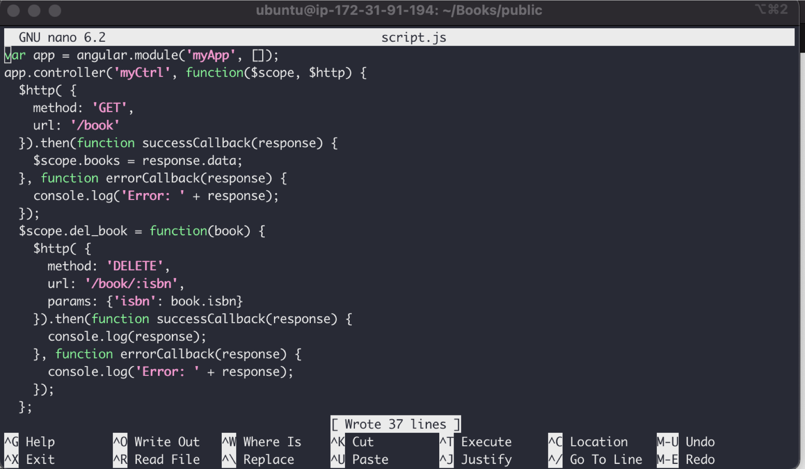

## MEAN STACK DEPLOYMENT TO UBUNTU IN AWS

Now, when you have already learned how to deploy LAMP, LEMP and MERN Web stacks – it is time to get yourself familiar with MEAN stack and deploy it to Ubuntu server.

MEAN Stack is a combination of following components:
1. [MongoDB](https://www.mongodb.com) (Document database) – Stores and allows to retrieve data.
2. [Express](https://expressjs.com) (Back-end application framework) – Makes requests to Database for Reads and Writes.
3. [Angular](https://angular.io) (Front-end application framework) – Handles Client and Server Requests4
4. [Node.js](https://nodejs.org/en/) (JavaScript runtime environment) – Accepts requests and displays results to end user

#### Side Self Study
1. Refresh your knowledge of [OSI model](https://en.wikipedia.org/wiki/OSI_model)
2. Read about [Load Balancing](https://en.wikipedia.org/wiki/Load_balancing_(computing)), get yourself familiar with different types and techniques of traffic load balancing.
3. Practice in editing simple web forms with [HTML + CSS + JS](https://html-css-js.com)

Instructions On How To Submit Your Work For Review And Feedback

To submit your work for review and feedback – follow [this instruction](https://www.darey.io/docs/how-to-submit-your-work-for-review-and-feedback-2/).

#### Step 0 – Preparing prerequisites
In order to complete this project you will need an AWS account and a virtual server with Ubuntu Server OS.

If you do not have an AWS account – go back to Project 1 Step 0 to sign in to AWS free tier account ans create a new EC2 Instance of t2.nano family with Ubuntu Server 20.04 LTS (HVM) image. Remember, you can have multiple EC2 instances, but make sure you STOP the ones you are not working with at the moment to save available free hours.

Hint: In previous projects we used different tools to connect to an EC2 instance, but if you do not want to install or launch anything outside of AWS, you can open youc CLI straight from Web Console in AWS, like this:

### Task
In this assignment you are going to implement a simple Book Register web form using MEAN stack.

#### Step 1: Install NodeJs
<mark>Node.js</mark> is a JavaScript runtime built on Chrome’s V8 JavaScript engine. <mark>Node.js</mark> is used in this tutorial to set up the Express routes and AngularJS controllers.

Update ubuntu

`sudo apt update`


Upgrade ubuntu

`sudo apt upgrade` 


Add certificates

`sudo apt -y install curl dirmngr apt-transport-https lsb-release ca-certificates`

`curl -sL https://deb.nodesource.com/setup_12.x | sudo -E bash -`


Install NodeJS

`sudo apt install -y nodejs`


#### Step 2: Install MongoDB
MongoDB stores data in flexible, <mark>JSON-like</mark> documents. Fields in a database can vary from document to document and data structure can be changed over time. For our example application, we are adding book records to MongoDB that contain book name, isbn number, author, and number of pages.
mages/WebConsole.gif

`sudo apt-key adv --keyserver hkp://keyserver.ubuntu.com:80 --recv 0C49F3730359A14518585931BC711F9BA15703C6`


`echo "deb [ arch=amd64 ] https://repo.mongodb.org/apt/ubuntu trusty/mongodb-org/3.4 multiverse" | sudo tee /etc/apt/sources.list.d/mongodb-org-3.4.list`


Install MongoDB

`sudo apt install -y mongodb`



Start The server

`sudo service mongod start`


Verify that the service is up and running

`sudo systemctl status mongodb`


Install [npm](https://www.npmjs.com) – Node package manager.

`sudo apt install -y npm`


Install [body-parser](https://www.npmjs.com/package/body-parser) package

We need ‘body-parser’ package to help us process JSON files passed in requests to the server.

`sudo npm install body-parser`


Create a folder named ‘Books’

`mkdir Books && cd Books`


In the Books directory, Initialize npm project

`npm init`


Add a file to it named <mark>server.js</mark>

`nano server.js`


Copy and paste the web server code below into the <mark>server.js</mark> file.

```
var express = require('express');
var bodyParser = require('body-parser');
var app = express();
app.use(express.static(__dirname + '/public'));
app.use(bodyParser.json());
require('./apps/routes')(app);
app.set('port', 3300);
app.listen(app.get('port'), function() {
console.log('Server up: http://localhost:' + app.get('port'));
});
```


### INSTALL EXPRESS AND SET UP ROUTES TO THE SERVER

#### Step 3: Install [Express](https://expressjs.com) and set up routes to the server

Express is a minimal and flexible <mark>Node.js</mark> web application framework that provides features for web and mobile applications. We will use Express in to pass book information to and from our MongoDB database.

We also will use [Mongoose](https://mongoosejs.com) package which provides a straight-forward, schema-based solution to model your application data. We will use Mongoose to establish a schema for the database to store data of our book register.

`sudo npm install express mongoose`


In ‘Books’ folder, create a folder named <mark>apps</mark>

`mkdir apps && cd apps`


Create a file named <mark>routes.js</mark>

`nano routes.js`


Copy and paste the code below into routes.js
```
var Book = require('./models/book');
module.exports = function(app) {
app.get('/book', function(req, res) {
Book.find({}, function(err, result) {
if ( err ) throw err;
res.json(result);
});
});
app.post('/book', function(req, res) {
var book = new Book( {
name:req.body.name,
isbn:req.body.isbn,
author:req.body.author,
pages:req.body.pages
});
book.save(function(err, result) {
if ( err ) throw err;
res.json( {
message:"Successfully added book",
book:result
});
});
});
app.delete("/book/:isbn", function(req, res) {
Book.findOneAndRemove(req.query, function(err, result) {
if ( err ) throw err;
res.json( {
message: "Successfully deleted the book",
book: result
});
});
});
var path = require('path');
app.get('*', function(req, res) {
res.sendfile(path.join(__dirname + '/public', 'index.html'));
});
};
```


In the ‘apps’ folder, create a folder named <mark>models</mark>

`mkdir models && cd models`


Create a file named <mark>book.js</mark>

`nano book.js`


Copy and paste the code below into ‘book.js’
```
var mongoose = require('mongoose');
var dbHost = 'mongodb://localhost:27017/test';
mongoose.connect(dbHost);
mongoose.connection;
mongoose.set('debug', true);
var bookSchema = mongoose.Schema( {
name: String,
isbn: {type: String, index: true},
author: String,
pages: Number
});
var Book = mongoose.model('Book', bookSchema);
module.exports = mongoose.model('Book', bookSchema);
```


#### Step 4 – Access the routes with [AngularJS](https://angularjs.org)

AngularJS provides a web framework for creating dynamic views in your web applications. In this tutorial, we use AngularJS to connect our web page with Express and perform actions on our book register.

Change the directory back to ‘Books’

`cd ../..`

Create a folder named <mark>public</mark>

`mkdir public && cd public`


Add a file named <mark>script.js</mark>

`nano script.js`


Copy and paste the Code below (controller configuration defined) into the script.js file.
```
var app = angular.module('myApp', []);
app.controller('myCtrl', function($scope, $http) {
$http( {
method: 'GET',
url: '/book'
}).then(function successCallback(response) {
$scope.books = response.data;
}, function errorCallback(response) {
console.log('Error: ' + response);
});
$scope.del_book = function(book) {
$http( {
method: 'DELETE',
url: '/book/:isbn',
params: {'isbn': book.isbn}
}).then(function successCallback(response) {
console.log(response);
}, function errorCallback(response) {
console.log('Error: ' + response);
});
};
$scope.add_book = function() {
var body = '{ "name": "' + $scope.Name +
'", "isbn": "' + $scope.Isbn +
'", "author": "' + $scope.Author +
'", "pages": "' + $scope.Pages + '" }';
$http({
method: 'POST',
url: '/book',
data: body
}).then(function successCallback(response) {
console.log(response);
}, function errorCallback(response) {
console.log('Error: ' + response);
});
};
});
```


In <mark>public</mark> folder, create a file named <mark>index.html</mark>;

`nano index.html`


Copy and paste the code below into <mark>index.html</mark> file.
```
<!doctype html>
<html ng-app="myApp" ng-controller="myCtrl">
  <head>
    <script src="https://ajax.googleapis.com/ajax/libs/angularjs/1.6.4/angular.min.js"></script>
    <script src="script.js"></script>
  </head>
  <body>
    <div>
      <table>
        <tr>
          <td>Name:</td>
          <td><input type="text" ng-model="Name"></td>
        </tr>
        <tr>
          <td>Isbn:</td>
          <td><input type="text" ng-model="Isbn"></td>
        </tr>
        <tr>
          <td>Author:</td>
          <td><input type="text" ng-model="Author"></td>
        </tr>
        <tr>
          <td>Pages:</td>
          <td><input type="number" ng-model="Pages"></td>
        </tr>
      </table>
      <button ng-click="add_book()">Add</button>
    </div>
    <hr>
    <div>
      <table>
        <tr>
          <th>Name</th>
          <th>Isbn</th>
          <th>Author</th>
          <th>Pages</th>

        </tr>
        <tr ng-repeat="book in books">
          <td>{{book.name}}</td>
          <td>{{book.isbn}}</td>
          <td>{{book.author}}</td>
          <td>{{book.pages}}</td>

          <td><input type="button" value="Delete" data-ng-click="del_book(book)"></td>
        </tr>
      </table>
    </div>
  </body>
</html>
```


Change the directory back up to <mark>Books</mark>

`cd ..`

Start the server by running this command:

`node server.js`


The server is now up and running, we can connect it via port 3300. You can launch a separate Putty or SSH console to test what <mark>curl</mark> command returns locally.

`curl -s http://localhost:3300`


It shall return an HTML page, it is hardly readable in the CLI, but we can also try and access it from the Internet.

For this – you need to open TCP port 3300 in your AWS Web Console for your EC2 Instance.

You are supposed to know how to do it, if you have forgotten – refer to [Project 1](https://starter-pbl.darey.io/en/latest/) (Step 1 — Installing Apache and Updating the Firewall)

Your Sercurity group shall look like this:


Now you can access our Book Register web application from the Internet with a browser using Public IP address or Public DNS name.

Quick reminder how to get your server’s Public IP and public DNS name:

You can find it in your AWS web console in EC2 details

Run `curl -s http://169.254.169.254/latest/meta-data/public-ipv4` for Public IP address or 

`curl -s http://169.254.169.254/latest/meta-data/public-hostname` for Public DNS name.

This is how your Web Book Register Application will look like in browser:


Congratulations!
You have now completed all ‘PBL Progressive’ projects and are ready to move on to more complex and fun [‘PBL Professional’ projects](https://readthedocs.com/cas/login?service=https%3A%2F%2Fprofessional-pbl.darey.io%2Fen%2Flatest%2F%3Fnext%3Dhttps%253A%252F%252Fprofessional-pbl.darey.io%252Fen%252Flatest%252F)!!!
